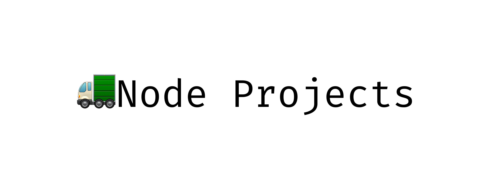

# 🧑🏻‍💻 Node Projects

🚛 Beginner To Advanced Node.js Projects. Choose a project that aligns with your interests and skill level, and use it as an opportunity to learn and experiment with Node.js. 

## 📋 Table of Contents

- [About](#🤡-about)
- [Projects](#💼-projects)
- [Contributing](#👥-contributing)
- [License](#🪪-license)

##  🤡 About

Node.js is an open-source, server-side JavaScript runtime that allows developers to build scalable, high-performance network applications. With its event-driven, non-blocking I/O model, Node.js is particularly well-suited for building real-time applications, APIs, and web servers.

Node.js projects encompass a wide range of applications and use cases, making it a versatile technology for web and server-side development. Here are some key aspects of Node.js projects:

## 💼 Projects

- [File Uploader](FileUploader)

## 👥 Contributing

Contributions are very welcome and wanted.

Make sure you have thoroughly read and understood the [CONTRIBUTING](CONTRIBUTING.md) guidelines.

## 🪪 License

Licensed under the ChatGPT. See the [LICENSE](MIT-LICENSE.txt) file for details.

